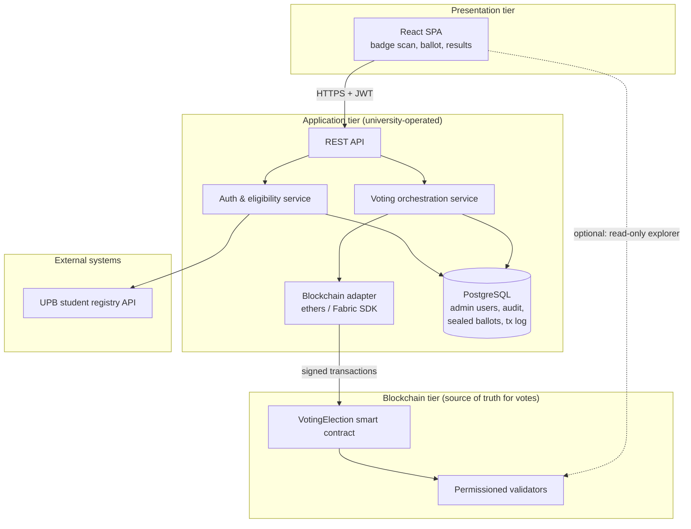
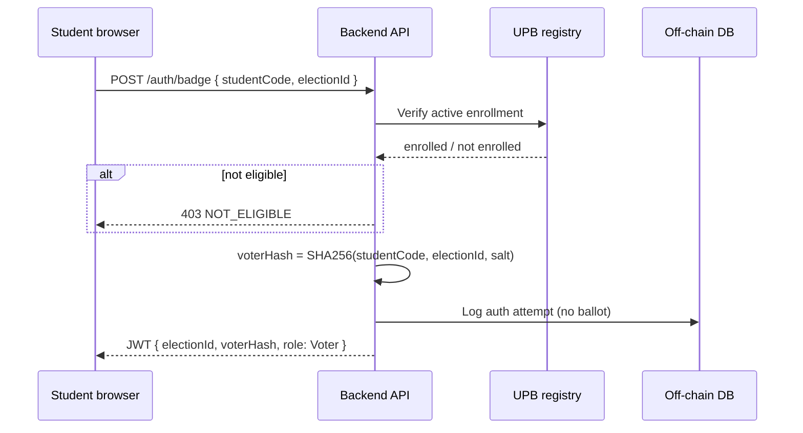
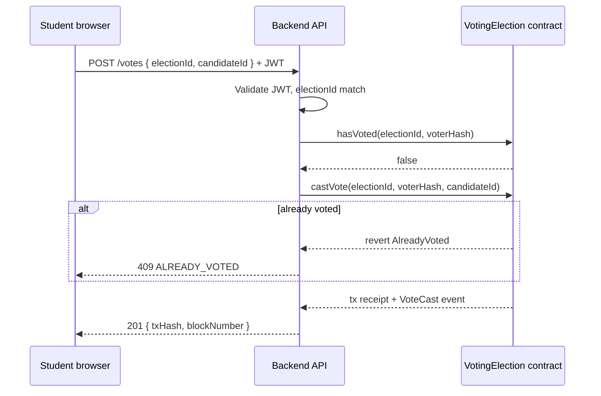
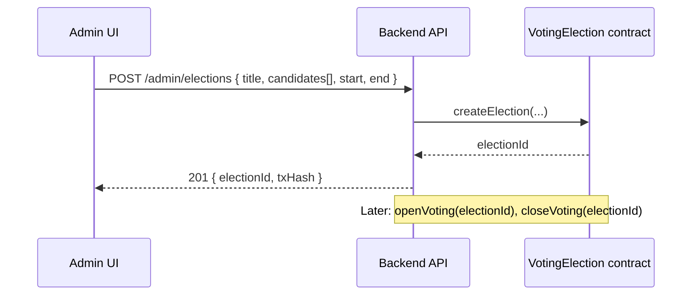
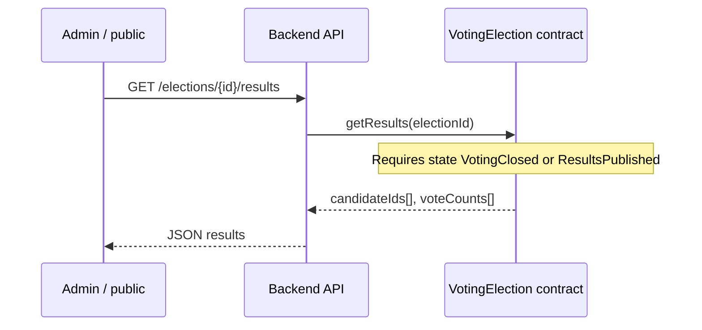
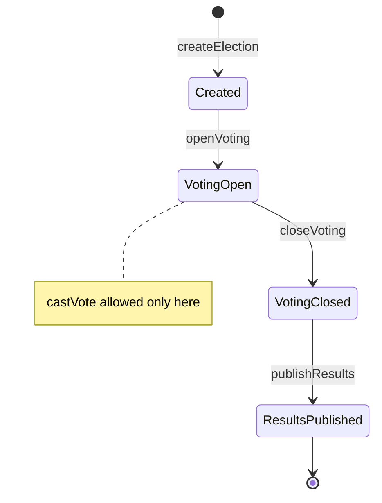
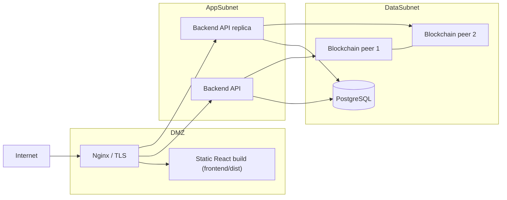

# System Architecture — UPB Blockchain Voting Application

This document defines how the **web frontend**, **backend API**, and **permissioned blockchain** work together. The backend does not implement voting rules in application code alone: **creating elections, accepting votes, enforcing one vote per student, and tallying results are enforced by smart contracts**. The backend authenticates students, derives pseudonymous voter identifiers, and submits signed transactions to the chain.

---

## 1. Architectural goals

| Goal | Owner |
|------|--------|
| Only eligible UPB students vote | Backend + university enrollment API |
| **One student → one vote** per election | **Smart contract** (`hasVoted` mapping) |
| **Vote creation** (recording a ballot) | **Smart contract** (`castVote`) |
| **Vote counting** (per-candidate totals) | **Smart contract** (`voteCounts` + `getResults`) |
| Election lifecycle (open / close) | **Smart contract** (state machine) |
| Student identity privacy on ledger | Backend hashes student code before any chain call |

---

## 2. High-level view



**Rule:** If backend and chain disagree on whether a student voted, **the chain wins**. The API checks chain state before accepting a new ballot.

---

## 3. Responsibility split

### 3.1 Frontend (React)

- Capture badge (camera / OCR) or manual student code entry.
- Display elections, candidates, confirmation, receipt (transaction hash).
- Call backend REST only — **students do not hold crypto wallets** in the MVP.
- Show results by reading `GET /elections/{id}/results` (backend reads from chain).

### 3.2 Backend (orchestrator, not vote authority)

| Module | Responsibility |
|--------|----------------|
| **Auth** | OCR/badge validation, UPB enrollment check, issue JWT |
| **Voter ID** | `voterHash = SHA-256(studentCode ‖ electionId ‖ domainSalt)` — never send raw student code to chain |
| **Voting** | Validate JWT + election window; call contract `castVote`; handle retries |
| **Election admin** | Call `createElection`, `openVoting`, `closeVoting` (admin role) |
| **Blockchain adapter** | Wallet managed by university; gas/fees on permissioned network |
| **DB** | Sessions, auth audit, optional encrypted ballot backup — **not** primary vote ledger |

### 3.3 Blockchain (business logic for votes)

| Function | Purpose |
|----------|---------|
| `createElection` | Register election metadata and candidates on-chain |
| `openVoting` / `closeVoting` | Enforce time/state gates |
| `castVote` | Record ballot, set `hasVoted`, increment `voteCounts` |
| `hasVoted` | Query for duplicate prevention |
| `getResults` | Return per-candidate totals after voting closes |

See [`contracts/VotingElection.sol`](../contracts/VotingElection.sol) for the canonical interface.

---

## 4. Core flows

### 4.1 Student authentication (off-chain)



### 4.2 Cast vote (backend → blockchain)



**Single-vote guarantee:** `castVote` uses `require(!hasVoted[electionId][voterHash])` then sets `hasVoted = true` before incrementing counts. Replayed API requests hit the same on-chain guard.

### 4.3 Create election (admin)



### 4.4 Count votes (on-chain)



Tallying is **reading aggregated counters** maintained during each `castVote` — no separate mutable database tally for production truth.

---

## 5. Election state machine (on-chain)



| State | `castVote` | `getResults` |
|-------|------------|--------------|
| Created | ❌ | ❌ |
| VotingOpen | ✅ | ❌ |
| VotingClosed | ❌ | ✅ (internal totals) |
| ResultsPublished | ❌ | ✅ (public) |

---

## 6. Data model

### 6.1 On-chain (smart contract storage)

```
Election {
  id, title, state, startTime, endTime
  candidates[]: { id, nameHash or short label }
}

mapping(electionId => mapping(voterHash => bool)) hasVoted
mapping(electionId => mapping(candidateId => uint256)) voteCounts
```

- **`voterHash`**: 32-byte pseudonym; unlinkable to name on ledger without off-chain salt leak.
- **`voteCounts`**: updated atomically inside `castVote` — this is the **official count**.

### 6.2 Off-chain (PostgreSQL application database)

The database **belongs in architecture diagrams** — it supports login and operations, not the authoritative vote ledger.

| Table / record | Stores | Does not store |
|----------------|--------|----------------|
| `AdminUser` | email, password hash, role | — |
| `AuthAudit` | timestamp, electionId, voterHash, success | ballot choice in audit row |
| — | **No ballot table** — secrets in student browser | — |
| `ChainTxLog` | txHash, electionId, voterHash, status | official vote totals |
| `Student` (optional) | rarely needed; badge auth uses UPB API + JWT | per-election vote state (use chain) |

**Students** typically do not have DB accounts; **admins** do. **Never** store ballot choices in DB. Tally via on-chain `revealVote` per student.

*See* [`PRIVATE_VOTING.md`](PRIVATE_VOTING.md).

---

## 7. Backend project structure (Node.js / JavaScript)

```
backend/
├── package.json
├── .env                        # RpcUrl, contract, oracle key, JWT
└── src/
    ├── index.js                # HTTP server (port 5122)
    ├── app.js                  # Express + /api routes
    ├── config.js
    ├── blockchain/
    │   ├── blockchainClient.js # ethers.js → VotingElection.sol
    │   └── VotingElection.abi.json
    ├── services/
    │   ├── auth.service.js     # Badge + UPB API + JWT
    │   ├── voterId.service.js  # SHA-256 voter hash
    │   ├── voting.service.js   # castVote, status, results
    │   └── electionAdmin.service.js
    ├── routes/                 # auth, votes, elections, admin
    └── middleware/             # JWT guards, errors
```

Stack: **Node.js 18+**, **Express**, **ethers v6**. The frontend uses `VITE_API_BASE_URL=http://localhost:5122/api`. See [`backend/README.md`](../backend/README.md).

---

## 8. REST API contract (backend surface)

Base URL: `/api` (matches `VITE_API_BASE_URL`).

### Auth

| Method | Path | Description |
|--------|------|-------------|
| `POST` | `/auth/badge` | Body: `{ studentCode, electionId }` → JWT |

### Elections (read)

| Method | Path | Description |
|--------|------|-------------|
| `GET` | `/elections` | List elections (metadata from DB + chain state) |
| `GET` | `/elections/{id}` | Detail + `votingOpen` flag from chain |
| `GET` | `/elections/{id}/results` | Proxies `getResults` after close |

### Votes

| Method | Path | Description |
|--------|------|-------------|
| `GET` | `/votes/status?electionId=` | Calls `hasVoted` on chain |
| `POST` | `/votes` | Body: `{ electionId, candidateId }` → `castVote` tx |

### Admin

| Method | Path | Description |
|--------|------|-------------|
| `POST` | `/admin/elections` | `createElection` |
| `POST` | `/admin/elections/{id}/open` | `openVoting` |
| `POST` | `/admin/elections/{id}/close` | `closeVoting` |

---

## 9. Blockchain adapter (backend ↔ contract)

The adapter holds one **oracle wallet** (university-operated) that submits transactions on behalf of authenticated students.

```text
// voting.service.js → castVote()
1. Assert JWT voterHash matches body electionId
2. If await getHasVoted(electionId, voterHash) → 409 ALREADY_VOTED
3. tx = await contract.castVote(electionId, voterHash, candidateId)  // onlyOracle
4. await tx.wait()
5. Return { txHash, blockNumber }
```

Configuration:

| Variable | Example |
|----------|---------|
| `BLOCKCHAIN_RPC_URL` | `http://localhost:8545` |
| `VOTING_CONTRACT_ADDRESS` | `0x…` |
| `ORACLE_PRIVATE_KEY` | stored in vault / user-secrets |
| `VOTER_ID_SALT` | application-wide salt for hashing |

---

## 10. Deployment topology



- **Permissioned network** (Hyperledger Besu, Quorum, or private Ganache for dev): low fees, controlled validators, suitable for ~50k students.
- **Development:** Hardhat node + deployed `VotingElection` + backend pointing to local RPC.

---

## 11. Security properties mapped to components

| Requirement | Mechanism |
|-------------|-----------|
| Eligibility | UPB API + JWT only after verification |
| **One vote per student** | **`hasVoted` on chain** + API pre-check |
| **Integrity of count** | **`voteCounts` only mutated in `castVote`** |
| Immutability | Blockchain append-only ledger |
| Authentication | Badge/OCR + TLS + JWT |
| Admin actions | `onlyRole(ADMIN)` on contract + API admin role |

**Limitation (document in thesis):** `candidateId` in the transaction calldata is visible to node operators unless you move to commitment-based voting with an off-chain reveal phase. The architecture supports upgrading to commitments later without changing the frontend API shape.

---

## 12. Frontend integration map

| Planned UI | API | Chain effect |
|------------|-----|--------------|
| Badge scan page | `POST /auth/badge` | none |
| Election list | `GET /elections` | read state |
| Ballot page | `POST /votes` | `castVote` |
| “Already voted” | `GET /votes/status` | `hasVoted` |
| Results page | `GET /elections/{id}/results` | `getResults` |
| Admin console | `/admin/elections/*` | `createElection`, `openVoting`, `closeVoting` |

Reuse existing modules under `frontend/src/`: `axiosConfig.ts`, `AuthRoute.tsx`, `QRScanner.tsx` (badge/token), React Query for mutations.

---

## 13. Implementation order

1. Deploy `VotingElection.sol` to local chain; unit-test `castVote` revert on double vote.
2. Scaffold backend with `IBlockchainClient` and three endpoints: `POST /votes`, `GET /votes/status`, `GET /elections/{id}/results`.
3. Wire `POST /auth/badge` + voter hashing.
4. Replace legacy bus routes in React with election/vote screens.
5. Add admin election management.
6. Load-test: N parallel votes; verify `voteCounts` matches N unique `voterHash` values.

---

## Related files

- Smart contract: [`contracts/VotingElection.sol`](../contracts/VotingElection.sol)
- Research writing plan: [`research-paper-plan.md`](../research-paper-plan.md)
