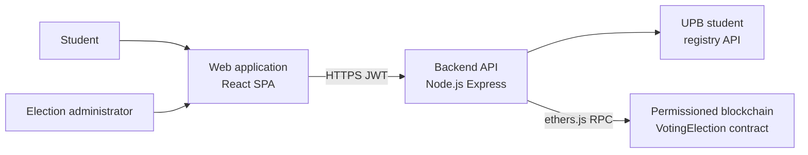
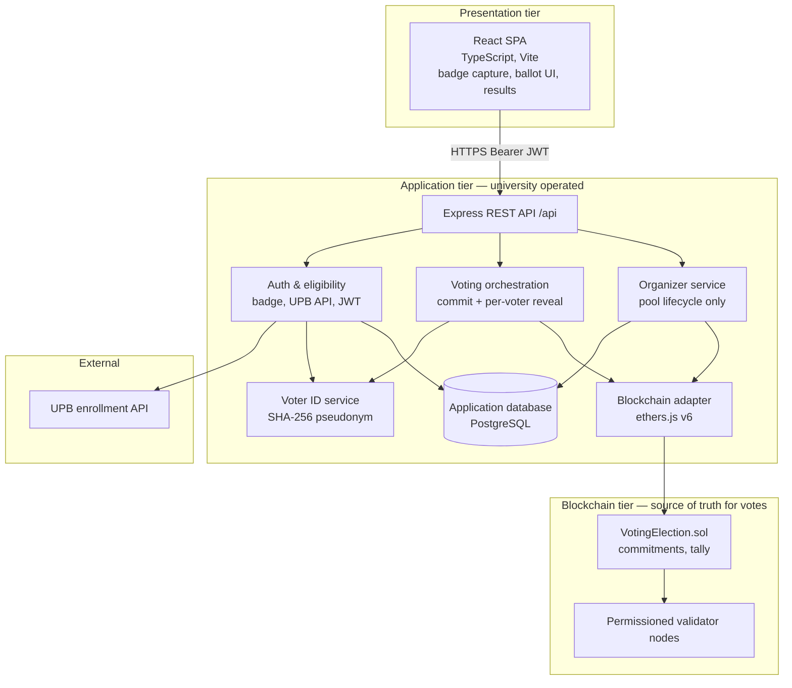
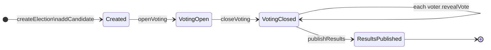
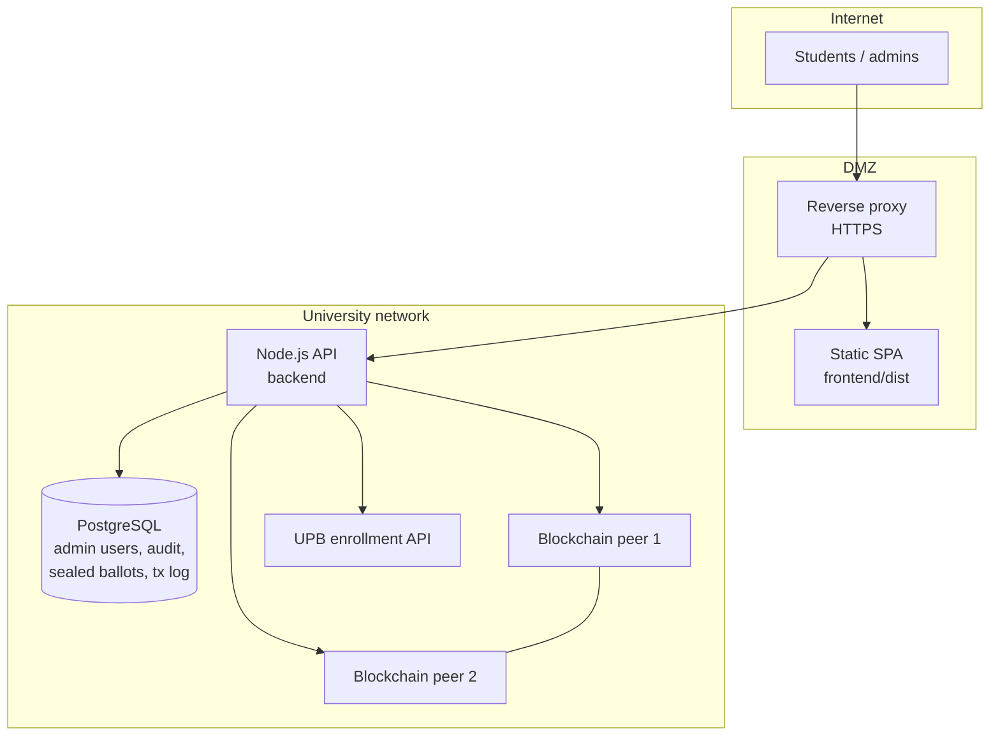

# Architecture

*Chapter for: Electronic Voting System For Students Using Blockchain Technology*  
*Copy into Word; export diagrams from Mermaid blocks below (e.g. [mermaid.live](https://mermaid.live)).*

**Figure index for this chapter**

| ID | Title | Source |
|----|--------|--------|
| Figure 4.1 | System context — actors and external systems | §4.1 |
| Figure 4.2 | Logical component architecture | §4.3 |
| Figure 4.3 | Deployment architecture (university pilot) | §4.6 |
| Figure 4.4 | Election lifecycle state machine | §4.5 |
| Table 4.1 | Comparison of blockchain voting architectural patterns | §4.2 |
| Table 4.2 | Logical layers and trust boundaries | §4.3 |
| Table 4.3 | On-chain vs off-chain data placement | §4.7 |
| Table 4.4 | Mapping security requirements to architectural elements | §4.8 |

---

## 4.1 System context and architectural goals

The prototype targets **university-level elections** at POLITEHNICA Bucharest (UPB), where students already possess institutional identification badges. The system must allow eligible students to cast **exactly one vote** per election, record ballots in a **tamper-resistant** store, and produce **verifiable totals** without relying on a single mutable database controlled by one administrator. At the same time, the solution must remain practical for a mobile-first student population and for pilot deployment on university infrastructure.

The architecture therefore separates concerns into three cooperating planes: a **web presentation layer** used by students and election administrators, an **application layer** operated by the university that performs identity verification and orchestrates blockchain access, and a **permissioned blockchain layer** that enforces voting rules and maintains authoritative vote counts through a smart contract.

The principal architectural goals are summarised as follows. **Eligibility** is enforced off-chain by integrating with the university student registry before any ballot is accepted. **Uniqueness** (one person, one vote) is enforced on-chain via a `hasVoted` mapping keyed by a pseudonymous voter identifier. **Vote integrity and tallying** are implemented on-chain: each valid ballot increments per-candidate counters inside the smart contract, and results are read from the contract after voting closes. **Privacy on the ledger** is preserved by storing only a cryptographic hash of the student identifier, never the raw badge number or name. **Usability** is achieved by hiding wallet management from students; a university-controlled oracle account submits transactions after REST authentication.

Figure 4.1 situates the system among its actors: students and administrators interact with the web client; the Node.js API communicates with the UPB enrollment service and with validator nodes hosting the `VotingElection` contract.



*Figure 4.1 — System context: students and administrators use the web application; the backend verifies enrollment and submits transactions to the permissioned blockchain.*

---

## 4.2 Architectural style: hybrid off-chain / on-chain model

Electronic voting architectures that use distributed ledgers are commonly classified by how much ballot data and logic reside on the chain. Three patterns are relevant to organisational elections such as UPB’s.

**Fully on-chain voting** stores encrypted or plaintext ballots as transactions on a public or private ledger. It maximises transparency but imposes high transaction cost and limited throughput on networks such as public Ethereum, making it unsuitable for tens of thousands of students in a short voting window.

**Off-chain voting with on-chain finalisation** keeps ballots in a central database and publishes only a hash of the final tally. It is inexpensive and fast but weakens individual verifiability: students cannot confirm that their own ballot was included without trusting the operator.

**Hybrid architecture** performs **authentication and eligibility off-chain** while anchoring **vote recording, uniqueness, and counting on-chain**. The present system adopts this pattern: the backend validates the UPB badge-derived student code and issues a short-lived JSON Web Token (JWT); the smart contract records the vote, marks the pseudonymous voter as having voted, and updates aggregate counts.

Table 4.1 compares the three patterns against criteria derived from the project requirements.

**Table 4.1 — Comparison of blockchain voting architectural patterns (university context)**

| Criterion | Fully on-chain | Hybrid (adopted) | Off-chain + final hash |
|-----------|----------------|------------------|-------------------------|
| Transaction cost at ~50k voters | High | Low (permissioned EVM) | Minimal |
| Throughput during peak voting | Limited | Suitable with private network | High |
| One-vote enforcement | Contract logic | Contract `hasVoted` | Application logic only |
| Tally integrity | On-chain | On-chain per-voter `revealVote` | Trusts central DB |
| Student wallet required | Often yes | No (oracle relayer) | No |
| UPB pilot feasibility | Low | **High** | Medium (weak audit) |

The hybrid model aligns with the technology choices documented in the research foundation: a **permissioned private blockchain** (implemented as an EVM-compatible network suitable for Hyperledger Besu or a local Hardhat node during development), **badge-based identification** with OCR on the client, and **hashed voter identifiers** on the ledger rather than personal data.

---

## 4.3 Logical architecture and component responsibilities

The implementation is organised as a **monorepo** with three deployable parts: `frontend/` (React single-page application), `backend/` (REST API), and `contracts/` (Solidity smart contract). Figure 4.2 shows the logical components and data flows between them.



*Figure 4.2 — Logical component architecture of the UPB blockchain voting prototype.*

Table 4.2 assigns responsibilities and trust assumptions to each layer.

**Table 4.2 — Logical layers and trust boundaries**

| Layer | Components | Responsibility | Trust assumption |
|-------|------------|----------------|------------------|
| Presentation | React SPA, browser camera | Capture badge, display elections and ballots, show transaction receipt | User device may be compromised; TLS required |
| Application | Express API, services, **database** | Verify enrollment, issue JWT, relay commitments and **per-voter reveals** as oracle | Oracle cannot forge commitments; must not store ballot secrets |
| Persistence | PostgreSQL (application DB) | **Organizer** accounts, auth audit, tx references only | **No central ballot table** — choices stay in student browser until reveal |
| Organizer | On-chain `organizer` + optional DB login | Create election pool, open/close, publish results **flag** | **Cannot** read votes, bulk tally, or alter counts |
| Identity | UPB registry integration | Confirm active student status | Authoritative enrollment data |
| Blockchain adapter | `blockchainClient.js` | Sign transactions, read contract state | Oracle private key protected |
| Ledger | `VotingElection` contract, peers | Enforce one vote, maintain counts, election phases | Honest majority of permissioned validators |

**Presentation tier.** Students access the system through a responsive web application built with React 19, TypeScript, and Vite. The client captures the institutional badge (camera-based OCR or manual entry of the student code), displays the list of open elections and candidates, and submits votes to the backend over HTTPS. Students do not install browser wallet extensions or manage private keys.

**Application tier.** The backend is implemented in **Node.js with Express**. It exposes a REST API under the `/api` prefix (default base URL `http://localhost:5122/api` in development). The **authentication service** validates the student code format, queries the UPB enrollment API (or a mock in development), and issues a JWT containing `electionId`, `voterHash`, and role `Voter`. The **voter identifier service** computes  
`voterHash = SHA-256(studentCode ∥ electionId ∥ salt)`  
so that the ledger never receives the raw badge number. The **voting service** checks JWT scope, queries `getHasVoted` on the contract, relays only a **commitment hash** on-chain (ballot secret stays in the student browser). The **organizer service** manages the pool and `publishResults` without access to votes or bulk tally.

**Application database (PostgreSQL).** A relational database is part of the target architecture and **should appear in all architecture diagrams** as the off-chain persistence layer used by the API. It is **not** a second vote ledger. Its role is to support **login and operations** that blockchains handle poorly or expensively:

| Stored in the database | Not stored as authoritative truth in the DB |
|------------------------|---------------------------------------------|
| **Administrator accounts** (email, password hash, role) for `POST /api/auth/admin/login` | Per-candidate **vote totals** (these come from the contract after tally) |
| **Authentication audit** (timestamp, `electionId`, `voterHash`, success/failure) | Whether a student voted (**chain:** `hasVoted`) |
| — | **Ballot secrets** (student `localStorage` only) |
| **Chain transaction log** (`txHash`, election, voter hash, status) for support and demos | Public proof of **how** someone voted (only commitment on chain) |

**Student “login”** does not require a row in a `students` table: eligibility is proven per election via the badge and UPB API, then a **stateless JWT** authorizes voting. Optionally, the database may log sessions or revoked tokens for security. **Organizer login** may use the database for scheduling only; organizers have **no API to list or change votes**.

**Blockchain tier.** The contract separates **`organizer`** (pool lifecycle, `publishResults`) from **`oracle`** (relay `castVote` / `revealVote`). Totals come only from verified per-voter reveals; the organizer cannot bulk-tally.

---

## 4.4 Core interaction flows

Four flows define runtime behaviour: student authentication, ballot submission, election administration, and result retrieval.

**Authentication (off-chain).** The student selects an election and submits a student code obtained from the UPB badge. The backend verifies active enrollment, derives `voterHash`, logs the authentication attempt (without storing the ballot choice), and returns a JWT. Subsequent requests include `Authorization: Bearer <token>`.

**Ballot submission (browser → chain via oracle).** The student selects a candidate in the browser. The client generates `nonce`, computes `commitment`, and sends `POST /api/votes` with `{ electionId, commitment }` (preferred). The oracle submits `castVote` on-chain. The student stores `candidateId` and `nonce` locally. Others see only a hash on the ledger—not the choice, not running totals.

**Reveal (after close).** When the organizer closes voting, each student calls `POST /api/votes/reveal` with their locally stored `candidateId` and `nonce`. The contract verifies the reveal and increments the matching candidate’s count. **No central party holds all secrets**, so no admin can “open every envelope” from a database.

**Organizer workflow.** The organizer creates the pool (`createElection`, candidates), `openVoting`, `closeVoting`, waits for student reveals, then `publishResults` so `getResults` becomes public. `publishResults` does not compute votes—it only unlocks reading counts already on the chain.

**Result retrieval.** During voting and the reveal window, `getResults` reverts. After publish, anyone may read verified totals from the contract.

---

## 4.5 Election lifecycle state machine

Election progress is modelled as a finite state machine implemented in the smart contract. Figure 4.4 illustrates the states and transitions.



*Figure 4.4 — Election lifecycle state machine (on-chain).*

| State | Numeric value | `castVote` permitted | `getResults` permitted |
|-------|---------------|--------------------|-------------------------|
| Created | 0 | No | No |
| VotingOpen | 1 | **Yes** | No |
| VotingClosed | 2 | No | No (tally pending) |
| ResultsPublished | 3 | No | Yes (public) |

Between `closeVoting` and `publishResults`, **each voter** (via the oracle) calls **`revealVote`**. The organizer cannot perform bulk tally. Events include `VoteCommitted` and `VoteRevealed`; `publishResults` only changes visibility of already-computed on-chain counts.

---

## 4.6 Deployment architecture

For **development and thesis demonstration**, all components may run on a single workstation: Vite dev server for the frontend (port 5173), Express API (port 5122), and a local EVM node (e.g. Hardhat, port 8545) with a deployed `VotingElection` instance. Environment variables supply the contract address, oracle private key, JWT secret, and voter-ID salt.

For a **university pilot**, the recommended deployment separates public access from internal services (Figure 4.3). A reverse proxy terminates TLS and serves the static React build from `frontend/dist`. The API runs as one or more Node.js processes behind the same proxy under `/api`. A **PostgreSQL** server on the internal network holds administrator accounts, authentication audit rows, sealed ballots (until tally), and blockchain transaction references. Validator nodes of a permissioned EVM network (e.g. two or more Besu peers) run on isolated hosts with persistent volumes for chain data. The database is **required** in the deployment diagram because login, audit, and sealed storage are standard parts of a student-facing pilot—not optional extras.



*Figure 4.3 — Deployment architecture for a university pilot (simplified).*

Secrets (`ORACLE_PRIVATE_KEY`, `JWT_SECRET`, `VOTER_ID_SALT`, UPB API keys) are injected via environment variables or a institutional secret store, never committed to source control.

---

## 4.7 Data placement and repository structure

Architectural decisions about **what data may appear on the ledger** directly affect student privacy and regulatory acceptability. Table 4.3 summarises the placement policy implemented in the prototype.

**Table 4.3 — On-chain vs off-chain data placement**

| Data element | Location | Rationale |
|--------------|----------|-----------|
| Raw student code (badge) | Off-chain only (transient in API) | Personal identifier; not replicated to peers |
| `voterHash` (SHA-256) | On-chain in `hasVoted`, events | Pseudonymity; enables uniqueness check |
| Ballot choice + `nonce` | Student device (`localStorage`) | Never in organizer-accessible DB |
| Vote **commitment** | On-chain | Hides choice during voting |
| Election title, candidate names | On-chain in contract storage | Public election metadata |
| Admin credentials | Application database | Email + password hash; admin login |
| Student voter JWT | Client + stateless claim | Short-lived; scoped to one election |
| Auth audit log | Application database | Operations; no long-term raw badge storage |
| Official vote totals | On-chain `voteCounts` after per-voter `revealVote` | Correct only if reveal matches commitment; hidden until `publishResults` |

The **repository layout** mirrors the logical tiers:

```
voting-system-upb/
├── frontend/          # React SPA
├── backend/           # Express API + ethers adapter
├── contracts/         # VotingElection.sol
└── docs/              # Architecture and thesis material
```

---

## 4.8 Security and non-functional considerations at architectural level

Security mechanisms are distributed across tiers rather than concentrated in a single database. Table 4.4 maps core e-voting requirements to architectural elements.

**Table 4.4 — Security requirements mapped to architecture**

| Requirement | Architectural realisation |
|-------------|---------------------------|
| Eligibility | UPB registry check before JWT; API rejects unenrolled students |
| One person, one vote | `hasVoted[electionId][voterHash]` in contract; API pre-check |
| Vote integrity | Commitments immutable; counts from verified `revealVote` only |
| Organizer scope | Pool lifecycle only; no ballot access |
| Transparency / audit | Permissioned ledger events; optional block explorer |
| Authentication | Badge-derived code + TLS + JWT scoped to one election |
| Separation of duties | Distinct admin and oracle roles on contract and API |

**Non-functional properties** are addressed as follows. **Scalability** for a full faculty is approached by horizontal scaling of stateless API instances and a permissioned chain with higher throughput than public Ethereum. **Availability** during the voting window relies on redundant API processes and multiple blockchain peers. **Usability** is supported by a mobile-friendly SPA and by eliminating student wallet setup. **Performance** targets for the pilot include sub-second API authentication and blockchain confirmation within seconds on a local permissioned network (exact measurements are reported in the evaluation accompanying the implementation chapter).

**Architectural limitations** acknowledged at this level include: (1) the backend **oracle** can observe `candidateId` when submitting transactions; (2) the prototype does not yet implement full coercion-resistance or client-side encryption; (3) OCR and optional selfie matching depend on camera quality and are primarily specified in the design chapter. These constraints are acceptable for a university proof-of-concept but would require further hardening for institution-wide production use.

---

## 4.9 Summary

The architecture combines a **React frontend** (holds ballot secrets), a **Node.js oracle API** (relays transactions without a central ballot store), optional **PostgreSQL** (organizer login and audit only), and a **`VotingElection` smart contract** with separate **organizer** and **oracle** roles. **No role can read or rewrite all votes**; the organizer only manages the election pool and publishes when totals may be read. Correctness of the count follows from cryptographic commitments and per-voter reveals on the ledger. The monorepo structure, REST API boundary, oracle-based transaction submission, and explicit election state machine provide a clear separation of concerns suitable for implementation, demonstration, and extension in later work (e.g. Docker-based Besu deployment, full UPB API integration, and enhanced ballot privacy).

---

*Technical reference for maintainers: [`docs/ARCHITECTURE.md`](../ARCHITECTURE.md). Next chapter: **Design** (detailed flows, API schemas, contract interface).*
